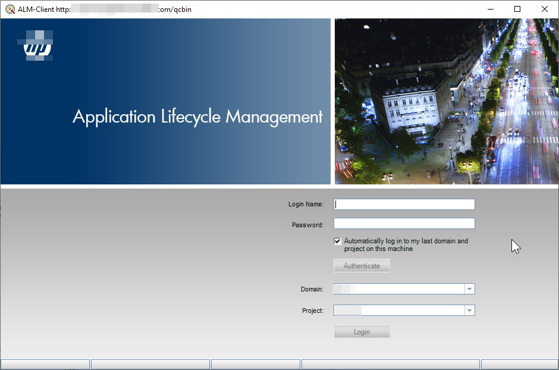

# ALM Launcher
A tiny tool to launch [HP-ALM][] client without legacy Internet Explorer.\
You still need to install the HP-ALM client binaries first (or let the system admin to copy the binary files from a pre-installed machine).

## Hints
* HP-ALM itself requires .NET Framework 4
* Normally the binary files (including 3rd party's extensions) are located in <kbd>LocalAppData</kbd> folder (`C:\Users\<username>\AppData\Local\HP\ALM-Client`)

[HP-ALM]: https://www.microfocus.com

## License
GPL